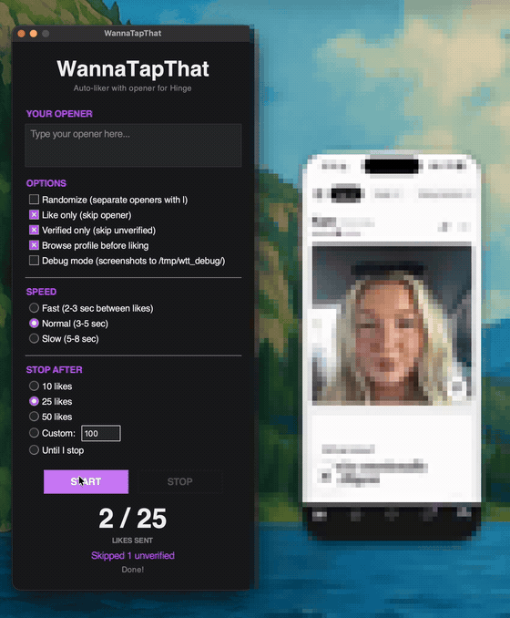

# WannaTapThat

**Auto-like Hinge profiles (and send your opener) from your Mac, by driving iPhone Mirroring.**

WannaTapThat is a small macOS app that watches your iPhone Mirroring window, finds the heart button on each Hinge profile, taps it, types the opener you wrote, and hits send — over and over, so you don't have to. It uses on-screen image matching (the same idea as a person looking at the screen and tapping), with human-like delays and random tap offsets.



*Demo: the app (left) auto-liking on Hinge. The phone screen is intentionally pixelated to protect real people's profiles.*

---

> ## ⚠️ Please read this before you download
>
> **This is an experimental, educational project. Use it at your own risk.**
>
> - **It violates Hinge's Terms of Service.** Automating activity on Hinge is against their rules. Using this app can get your account **banned, shadowbanned, or rate-limited.** There is no way to make automation "safe" or "undetectable," and this app does not claim to be either.
> - **It interacts with real people.** Every profile it likes is a real human who will believe a person chose them and wrote to them. Don't be a jerk. Use a thoughtful, genuine opener. Don't spam.
> - **Provided as-is, with no warranty.** The author is **not responsible** for banned accounts, lost matches, awkward conversations, or any other consequences of using this software.
> - This is not affiliated with, endorsed by, or connected to Hinge or Match Group in any way.
>
> If any of that isn't okay with you, don't use this. That's a completely reasonable choice.

---

## What you need

| Requirement | Details |
|---|---|
| **A Mac running macOS Sequoia (15) or later** | iPhone Mirroring is a macOS 15+ feature. |
| **iPhone Mirroring set up and working** | Your iPhone must be paired with this Mac and able to mirror its screen. Open the **iPhone Mirroring** app and confirm you can see and control your phone first. |
| **An iPhone signed into Hinge** | Open Hinge on the mirrored phone and get to the swiping/discover screen. |
| **Screen Recording permission** | So the app can "see" the iPhone Mirroring window. |
| **Accessibility permission** | So the app can tap and type for you. |

You'll grant the two permissions during setup (below).

---

## Install

### Easiest — one command

Open **Terminal** (press ⌘-Space, type "Terminal", hit Return), then paste this and press Return:

```bash
curl -fsSL https://raw.githubusercontent.com/saltxd/tapthat-clicker/main/install.sh | bash
```

That's it — it downloads the app, installs it to **Applications**, gets it past macOS's "unidentified app" block automatically, and opens it. Skip to [step: grant permissions](#grant-the-two-permissions). *(Curious / cautious? The script is short — read it [here](install.sh) first.)*

### Or install manually (no Terminal)

1. **Download** the latest **`WannaTapThat.dmg`** from the [**Releases**](../../releases) page.
2. Open the `.dmg` and drag **WannaTapThat** onto the **Applications** folder.
3. **Get past Gatekeeper.** This app isn't signed by an Apple Developer account or notarized (that costs $99/yr the author hasn't spent), so macOS blocks the first launch with *"Apple could not verify 'WannaTapThat' is free of malware"* or *"is damaged."* That's expected for an unsigned app:
   - Double-click **WannaTapThat** once — it gets blocked; dismiss the warning.
   - Open **System Settings → Privacy & Security**, scroll to *"WannaTapThat was blocked to protect your Mac,"* and click **Open Anyway** → confirm.

   It opens, and every launch after that is normal.

   > On macOS Sequoia the old "right-click → Open" trick no longer works for unsigned apps — use **Open Anyway** above, or run `xattr -dr com.apple.quarantine /Applications/WannaTapThat.app` in Terminal and open it normally.

### Grant the two permissions

The first time you run it, macOS will prompt you for permissions. If it doesn't, grant them manually:

1. Open **System Settings → Privacy & Security**.
2. Under **Screen Recording**, turn on **WannaTapThat**.
3. Under **Accessibility**, turn on **WannaTapThat**.
4. Quit and reopen the app if it asks you to.

> **Important:** macOS ties these permissions to the exact build of the app. **Every time you install an app update, the permissions reset** and you'll need to turn them back on for the new version. See [Troubleshooting](#troubleshooting) if the app can't see your phone after an update.

---

## How to use

1. Open **iPhone Mirroring** and make sure you can see your phone.
2. Open **Hinge** on the mirrored phone and get to the main discover screen (where you swipe through profiles).
3. Open **WannaTapThat**.
4. Type your **opener** in the box at the top.
5. Pick your options and speed (below).
6. Choose **how many** likes to send.
7. Click **START**.

Leave it alone while it runs — it's controlling your phone, so don't click around. Click **STOP** any time. The big counter shows how many likes it has sent.

### Your opener

Whatever you type in the opener box gets sent with each like. Write something real — it's going to a real person.

### Options

| Option | What it does |
|---|---|
| **Randomize (separate openers with `\|`)** | Type several openers separated by a `\|` (pipe) character, e.g. `Hey, love your dog! \| That hiking pic is great \| What's your go-to coffee order?`. The app picks one at random for each profile, so you're not sending the same line every time. |
| **Like only (skip opener)** | Just likes profiles without writing anything. The opener box is ignored. |
| **Verified only (skip unverified)** | Only likes profiles that have Hinge's **verified badge**. Unverified profiles are skipped (the app taps the X to pass) and counted in the "Skipped" line. If it hits a long run of unverified profiles in a row, it stops on its own as a safety check. |
| **Browse profile before liking** | Scrolls down through the profile, pauses as if reading, then scrolls back to the top and likes. Slower, but more human-like. |
| **Debug mode** | Saves screenshots and a log of every step to `/tmp/wtt_debug/`. Useful if something isn't working and you want to see what the app saw. |

### Speed

How long it waits between profiles:

| Speed | Delay |
|---|---|
| **Fast** | 2–3 seconds |
| **Normal** | 3–5 seconds |
| **Slow** | 5–8 seconds |

Slower is more human-like. It also occasionally inserts longer pauses on its own to mimic someone actually reading.

### Stop after

Choose **10**, **25**, or **50** likes, enter a **Custom** number, or pick **Until I stop** to run until you click STOP. The counter shows progress (e.g. `12 / 25`).

Your opener and all your settings are remembered for next time.

---

## Troubleshooting

### "iPhone Not Found" / no iPhone window

- Make sure the **iPhone Mirroring** app is actually open and showing your phone before you click START.
- Confirm **Screen Recording** permission is on for WannaTapThat (**System Settings → Privacy & Security → Screen Recording**).
- If you just updated the app, the permission likely reset — see the section below.

### The app can't see my phone after I updated it

This is the most common issue. macOS links Screen Recording and Accessibility permissions to the specific build of the app, so **a new version is treated as a brand-new app** and the old permission toggle doesn't apply.

Fix it:

1. Open **System Settings → Privacy & Security**.
2. Toggle **WannaTapThat** **off and back on** under both **Screen Recording** and **Accessibility**.
3. Quit and reopen WannaTapThat.

If toggling doesn't help, fully reset the permissions and re-grant them. In Terminal:

```bash
tccutil reset ScreenCapture
tccutil reset Accessibility
```

Then reopen the app and grant the permissions again when prompted.

### "Capture failed" / "Screen Recording permission needed"

The app found the window but couldn't read its pixels — that's a Screen Recording permission problem. Follow the steps above to re-grant it, then restart the app.

### "No heart found"

The app couldn't locate the like button on the screen. Usually one of:

- You're **not on the Hinge discover/profile screen** (you're in chat, settings, a paywall, etc.). Get back to the profile view and try again.
- The **iPhone Mirroring window is too small, partly off-screen, or covered.** Make it larger and fully visible.
- Hinge changed its layout in an app update. Turn on **Debug mode**, run it once, and check the screenshots in `/tmp/wtt_debug/` to see what it captured. (Layout changes may require a new release.)

### It's tapping the wrong thing / sending in the wrong place

Keep the iPhone Mirroring window fully visible and don't resize or move it while the app runs. Don't click or type on your Mac during a run — you'll fight the automation for control.

### It stopped on its own

The app stops itself after too many failures in a row (for example, if it loses the window or runs out of profiles), or — in **Verified only** mode — after a long streak of unverified profiles. Check the status line at the bottom for the reason.

---

## FAQ

**Is it safe?**
Technically your Mac is fine. Your Hinge *account* is the thing at risk. Automating Hinge breaks their Terms of Service, so there's a real chance of a ban or shadowban. Nobody can promise otherwise — use it knowing that.

**Will I get banned?**
Maybe. There's no way to guarantee you won't. Going slow, sending genuine openers, and not running it for hours on end is more cautious than blasting Fast on Unlimited — but "more cautious" is not "safe." You're accepting the risk.

**Does it work on Tinder?**
No. WannaTapThat is built specifically for **Hinge's** layout. (There's a separate sibling project for Tinder, but this app is Hinge-only.)

**Why is it asking for Screen Recording permission?**
It's not recording or uploading anything. The only way for the app to "see" the heart button is to read the pixels of the iPhone Mirroring window, and macOS classifies reading another window's pixels as "Screen Recording." Everything stays on your Mac.

**Does it send my data anywhere?**
No. There's no server and no account. Your opener and settings are saved locally on your Mac (in `~/Library/Application Support/WannaTapThat/`).

**Why does macOS say it's "damaged" or "can't be checked"?**
Because it isn't code-signed or notarized by Apple. It's not actually damaged. See [Install, step 3](#3-open-it-the-first-time-gatekeeper).

---

## Building from source (for developers)

WannaTapThat is Python (tkinter UI) using PyObjC/Quartz for window access and OpenCV for template matching, packaged into a `.app` with PyInstaller.

```bash
# Run it directly during development
python3 -m venv venv && source venv/bin/activate
pip install -r requirements.txt
python gui.py

# Build the macOS .app bundle (PyInstaller)
./build.sh

# Package it into a DMG (needs: brew install create-dmg)
./create-dmg.sh
```

The `resources/` folder holds the template images (heart, send button, verified badge, skip button, etc.) used to find UI elements. If a Hinge restyle breaks matching, re-capture and replace those PNGs.

For maintainers cutting a release (code signing, notarization, and publishing a download that installs cleanly), see **[RELEASING.md](RELEASING.md)**.

> **Heads up on permissions when rebuilding:** every rebuild produces a new code signature, which macOS treats as a new app — so Screen Recording and Accessibility permissions reset on each build. To re-grant cleanly, run `tccutil reset ScreenCapture` and `tccutil reset Accessibility`, then relaunch. You can also run bundled diagnostics without the UI:
>
> ```bash
> ./dist/WannaTapThat.app/Contents/MacOS/WannaTapThat --diagnostics
> ```
>
> This prints window-lookup and capture results and writes `/tmp/debug_capture.png` when capture works.

---

## License & disclaimer

Released under the [MIT License](LICENSE) — provided **as-is**, with no warranty of any kind. This is an experimental, educational project. Using it to automate Hinge violates Hinge's Terms of Service and may result in account action. You are solely responsible for how you use it and for any consequences. Not affiliated with Hinge or Match Group.

*Be thoughtful. Real people are on the other side of every tap.*
